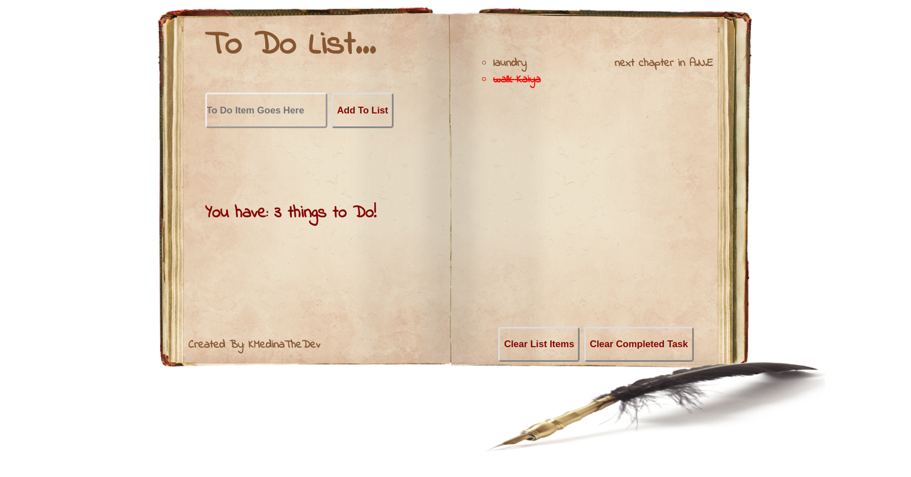

# To Do List

I used HTML, CSS, & JavaScript to create this interactive To Do List.

# How it Works:

Users can enter task they have to complete, keep track of the tasks to complete as well as completed tasks by marking them complete(click on the tasks for a strike-through). The user can edit or remove a tasks, or clear all completed tasks.

# Challenges Faced:

I was having trouble keeping the list looking neat after a certain amount of tasks, I did some research and decided to use columns in order to organize my list items more efficiently for both space and visual aesthetics. 
